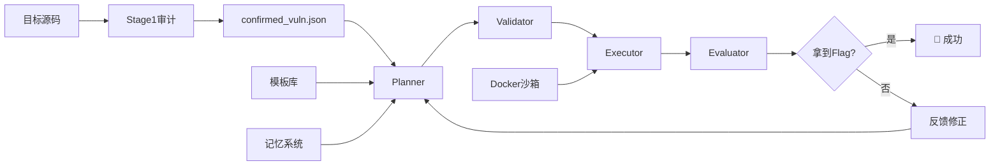

# Co-RedTeam: 自动化多阶段红队攻击框架

> **基于LLM的智能漏洞利用系统** — 从代码审计到Flag提取的全自动化攻击链

[](./README.md#stage1--代码审计引擎)
[](./README.md#stage2--攻击执行引擎)
[](./README.md#安全架构)
[](./README.md#模板系统)

---

## 📖 目录

- [项目简介](#项目简介)
- [核心特性](#核心特性)
- [架构设计](#架构设计)
  - [整体流程](#整体流程)
  - [模块说明](#模块说明)
- [快速开始](#快速开始)
- [使用指南](#使用指南)
  - [Stage1: 代码审计](#stage1-代码审计)
  - [Stage2: 攻击执行](#stage2-攻击执行)
  - [模板管理系统](#模板管理系统)
- [模板系统详解](#模板系统详解)
  - [架构设计](#架构设计-1)
  - [CLI工具](#cli工具)
  - [自定义模板](#自定义模板)
  - [模板积累策略](#模板积累策略)
- [通用性评估](#通用性评估)
  - [能解决的题目类型](#能解决的题目类型)
  - [局限性](#局限性)
  - [扩展建议](#扩展建议)
- [实战案例：ApexSurvive](#实战案例apexsurvive)
- [开发指南](#开发指南)
- [常见问题](#常见问题)
- [路线图](#路线图)

---

## 项目简介

Co-RedTeam（**Co**llaborative **Red Team**）是一个**基于大语言模型（LLM）的自动化红队攻击框架**，专门用于CTF竞赛和Web安全渗透测试。

### 核心创新

✨ **双阶段架构**
- **Stage1**: 智能代码审计引擎（静态分析+LLM理解）
- **Stage2**: 多步攻击链自动生成与执行

✨ **可插拔模板系统**
- YAML格式的攻击模板，支持热插拔
- CLI管理工具，社区可共享
- 内置通用模板 + 题目专项模板

✨ **安全沙箱执行**
- Docker容器隔离执行所有攻击代码
- 完整的安全审计日志
- 超时和资源限制

✨ **长期记忆学习**
- ChromaDB向量数据库存储历史经验
- 攻击模式自动归纳
- 跨任务知识迁移

---

## 核心特性

| 特性 | 描述 |
|------|------|
| 🤖 **LLM驱动** | 使用DeepSeek API进行漏洞理解和攻击规划 |
| 🔗 **多步攻击链** | 自动设计5-10步的复杂攻击序列 |
| 🛡️ **Docker沙箱** | 所有代码在隔离容器中执行，保护宿主机 |
| 📚 **模板库** | 可扩展的YAML模板系统，支持各类Web漏洞 |
| 🧠 **记忆系统** | 向量数据库存储成功/失败经验，持续学习 |
| 🔍 **协议自适应** | 自动检测HTTP/HTTPS，正确处理SSL证书 |
| 🎯 **目标检测** | 自动识别题目类型（ApexSurvive、通用Web等） |

---

## 架构设计

### 整体流程

```
┌─────────────────────────────────────────────────────────────┐
│                    Stage 1: 代码审计                         │
│  ┌──────────┐    ┌──────────┐    ┌──────────┐              │
│  │ 目标代码  │ → │ 静态分析  │ → │ LLM理解   │              │
│  │ (源码)   │    │ (AST/正则)│    │ (漏洞描述)│              │
│  └──────────┘    └──────────┘    └──────────┘              │
│                        ↓                                   │
│              confirmed_vuln.json                            │
│         （结构化漏洞报告 + 攻击链）                           │
└─────────────────────────────────────────────────────────────┘
                          ↓
┌─────────────────────────────────────────────────────────────┐
│                   Stage 2: 攻击执行                         │
│  ┌──────────┐    ┌──────────┐    ┌──────────┐    ┌───────┐ │
│  │ Planner  │ → │ Validator│ → │ Executor │ → │Eval- │ │
│  │ (规划)   │    │ (验证)   │    │ (执行)   │    │uator │ │
│  └──────────┘    └──────────┘    └──────────┘    └───────┘ │
│       ↑                ↑             ↑              ↑      │
│  模板库           安全检查      Docker沙箱     反馈迭代    │
│  记忆系统         语法校验      超时控制      结果评估     │
└─────────────────────────────────────────────────────────────┘
                          ↓
                    🚩 Flag获取！
```

### 模块说明

#### 核心组件

```
b/
├── coordinator.py          # 主协调器（Pipeline编排）
├── agents/
│   ├── planner.py          # 攻击规划器（LLM驱动）
│   ├── validator.py        # 计划验证器（语法+安全）
│   ├── executor.py         # 执行器（Docker沙箱）
│   └── evaluator.py        # 结果评估器（反馈循环）
├── core/
│   ├── llm_client.py       # LLM客户端（DeepSeek API）
│   ├── memory_store.py     # 长期记忆（ChromaDB）
│   ├── settings.py         # 配置管理
│   └── template_manager.py # 模板管理器（新增！）
├── templates/              # 攻击模板库（新增！）
│   ├── generic/            # 通用模板
│   │   ├── generic-ssti.yaml
│   │   ├── generic-xss-css.yaml
│   │   └── generic-sqli.yaml
│   └── apexsurvive/        # ApexSurvive专项
│       ├── apex-ssti-register.yaml
│       ├── apex-css-injection.yaml
│       ├── apex-race-condition.yaml
│       └── ...
├── data/
│   └── confirmed_vuln.json # Stage1输出（Stage2输入）
├── memory/                 # 向量数据库存储
├── cli.py                  # 模板管理CLI（新增！）
├── Dockerfile              # 沙箱环境定义
└── requirements.txt        # Python依赖
```

#### 数据流



---

## 快速开始

### 环境要求

- Python 3.10+
- Docker Desktop（用于沙箱执行）
- DeepSeek API Key（或使用Mock模式）

### 安装步骤

```bash
# 1. 克隆项目
cd c:\Users\ADMIN\redteam\b

# 2. 创建虚拟环境
python -m venv venv
venv\Scripts\activate  # Windows
# source venv/bin/activate  # Linux/Mac

# 3. 安装依赖
pip install -r requirements.txt

# 4. 配置环境变量
cp .env.example .env
# 编辑 .env，填入 DEEPSEEK_API_KEY

# 5. 构建Docker镜像（沙箱环境）
docker build -t co-redteam-sandbox:latest .

# 6. 初始化攻击模板（可选但推荐）
python cli.py init-apexsurvive
```

### 基本使用

```bash
# 运行完整Pipeline（Stage1 + Stage2）
python coordinator.py --confirmed data/confirmed_vuln.json

# 仅运行Stage2（如果已有漏洞报告）
python coordinator.py --confirmed data/confirmed_vuln.json --skip-stage1

# Mock模式（不调用LLM，用于测试）
set CO_REDTEAM_MOCK_LLM=true
python coordinator.py
```

---

## 使用指南

### Stage1: 代码审计

**输入**: 目标应用源码目录  
**输出**: `confirmed_vuln.json`（结构化漏洞报告）

**功能**:
- 静态代码分析（AST解析、正则匹配）
- LLM辅助漏洞理解和攻击链设计
- CWE分类和严重性评级
- 自动生成PoC概念

**配置文件格式** (`confirmed_vuln.json`):
```json
{
  "target_context": {
    "base_url": "https://host.docker.internal:9443",
    "app_name": "apexsurvive",
    "discovered_routes": ["@api.route('/login')", ...]
  },
  "vulnerabilities": [
    {
      "id": "VULN-001",
      "cwe_id": "CWE-94",
      "title": "SSTI via Email Field",
      "severity": "CRITICAL",
      "source": "user input (email)",
      "sink": "render_template_string()",
      "attack_chain": "register → sendEmail → SSTI → RCE",
      "evidence": {
        "file": "util.py",
        "lines": "35-36",
        "code_snippet": "render_template_string(..., email=email)"
      }
    }
  ]
}
```

### Stage2: 攻击执行

**输入**: `confirmed_vuln.json`  
**输出**: `workspace/execution_result.json`（执行结果）

**核心流程**:

1. **Planner** - LLM生成多步攻击计划
   - 加载目标专用/通用攻击模板
   - 分析漏洞依赖关系
   - 设计完整攻击链（5-10步）

2. **Validator** - 计划安全性验证
   - Python单行代码语法检查
   - 危险命令拦截（rm -rf, pipe to sh等）
   - URL路径白名单验证

3. **Executor** - Docker沙箱执行
   - 每个步骤独立容器执行
   - 超时控制（默认300秒）
   - CHAIN_OUTPUT跨步骤数据传递

4. **Evaluator** - 结果评估与反馈
   - 检测是否获取Flag
   - 分析失败原因
   - 生成修正建议给Planner

**示例输出** (`execution_result.json`):
```json
{
  "version": 1,
  "executed": true,
  "total_steps": 8,
  "step_results": [
    {
      "step_id": 1,
      "type": "python",
      "purpose": "注册测试账号",
      "result": {"ok": true, "exit_code": 0, "stdout": "..."},
      "chain_output": {"session_token": "eyJ..."}
    },
    ...
  ],
  "chain_context": {...},
  "execution_mode": "docker"
}
```

### 模板管理系统

#### 初始化模板库

```bash
# 初始化ApexSurvive专项模板（6个精准模板）
python cli.py init-apexsurvive

# 输出：
# ✅ 创建: apex-ssti-register
# ✅ 创建: apex-css-injection
# ✅ 创建: apex-race-condition
# ✅ 创建: apex-csrf-bypass
# ✅ 创建: apex-file-upload-rce
# ✅ 创建: apex-sw-injection
```

#### 查询和管理模板

```bash
# 列出所有模板
python cli.py list

# 查看模板详情
python cli.py show apex-ssti-register

# 按CWE查询
python cli.py query --cwe CWE-79

# 按目标类型查询
python cli.py query --target apexsurvive

# 统计信息
python cli.py stats
```

#### 导入/导出模板

```bash
# 导出模板为YAML（方便分享）
python cli.py export apex-ssti-register my_template.yaml

# 从文件导入模板
python cli.py import shared_template.yaml

# 删除模板
python cli.py remove template-id
```

---

## 模板系统详解

### 架构设计

```
templates/
├── generic/                    # 通用模板（适用于所有Web应用）
│   ├── generic-ssti.yaml      # SSTI模板注入
│   ├── generic-xss-css.yaml   # XSS/CSS注入
│   ├── generic-sqli.yaml      # SQL注入
│   ├── generic-race.yaml      # 竞态条件
│   ├── generic-upload.yaml    # 文件上传
│   └── ...
│
└── apexsurvive/               # ApexSurvive专项（精准利用代码）
    ├── apex-ssti-register.yaml
    ├── apex-css-injection.yaml
    ├── apex-race-condition.yaml
    ├── apex-csrf-bypass.yaml
    ├── apex-file-upload-rce.yaml
    └── apex-sw-injection.yaml
```

**三层加载优先级**:
1. **外部模板** (`templates/` 目录) - 最高优先级
2. **内置专项模板** (planner.py中的`_build_cwe_templates_apexsurvive`)
3. **内置通用模板** (planner.py中的`_build_cwe_templates_generic`)

### 模板格式规范

每个模板是一个YAML文件，包含两个部分：

```yaml
metadata:
  id: "unique-template-id"          # 唯一标识符
  name: "模板显示名称"                # 人类可读名称
  cwe_ids:                           # 适用漏洞类型
    - "CWE-94"
    - "CWE-917"
  target_type: "generic" | "apexsurvive"  # 目标类型
  tags:                               # 搜索标签
    - ssti
    - jinja2
    - rce
  author: "co-redteam"               # 作者
  severity: critical | high | medium | low  # 严重性
  version: "1.0.0"                   # 版本号
  indicators:                        # 目标检测关键词（可选）
    - "generateTemplate"
    - "render_template_string"

content: |
  这里是模板的实际内容...
  
  可以包含：
  - 漏洞原理说明
  - 完整的Python利用代码（单行格式）
  - 多步骤攻击链
  - 注意事项和技巧
  
  使用占位符：
  - {TARGET_BASE_URL}  → 自动替换为目标URL
  - {VERIFY_FLAG}      → 自动根据HTTP/HTTPS设置
  - {INJECTION_ENDPOINT} → 需要手动指定注入点
```

### CLI工具

完整的命令行界面，支持模板的全生命周期管理：

```bash
# 查看帮助
python cli.py --help

# 子命令列表
python cli.py --help
```

**主要命令**:

| 命令 | 功能 | 示例 |
|------|------|------|
| `list` | 列出所有模板 | `python cli.py list` |
| `show <id>` | 查看模板详情 | `python cli.py show apex-race-condition` |
| `add <file>` | 从YAML添加模板 | `python cli.py add my_template.yaml` |
| `remove <id>` | 删除模板 | `python cli.py remove old-template` |
| `export <id>` | 导出为YAML | `python cli.py export apex-ssti ssti.yaml` |
| `import <file>` | 导入模板 | `python cli.py import community_template.yaml` |
| `query` | 按条件查询 | `python cli.py query --cwe CWE-79 --target apexsurvive` |
| `stats` | 统计信息 | `python cli.py stats` |
| `init-apexsurvive` | 初始化示例模板 | `python cli.py init-apexsurvive` |

### 自定义模板

#### 方法1: 手动创建YAML文件

```bash
# 1. 创建模板目录
mkdir templates/my-challenge

# 2. 编写模板文件
cat > templates/my-challenge/sqli-exploit.yaml << 'EOF'
metadata:
  id: "my-sqli-auth-bypass"
  name: "SQL注入认证绕过"
  cwe_ids:
    - "CWE-89"
  target_type: "my-challenge"
  tags:
    - sqli
    - auth-bypass
    - login
  author: "your-name"
  severity: "critical"

content: |
  目标：登录接口的SQL注入
  
  利用代码：
  import requests,urllib3,json; urllib3.disable_warnings(); base='{TARGET_BASE_URL}'
  payload="' OR '1'='1' -- "
  r=requests.post(f'{base}/login', data={'username':payload,'password':'x'}, verify={VERIFY_FLAG})
  print('###CHAIN_OUTPUT###'+json.dumps({'status':r.status_code,'body':r.text[:300]}))
EOF

# 3. 添加到系统
python cli.py add templates/my-challenge/sqli-exploit.yaml
```

#### 方法2: 从Writeup自动生成

如果你有成功的CTF Writeup，可以快速转换为模板：

```python
# writeup_to_template.py（示例脚本）
import yaml

writeup_content = """
# My Challenge Writeup

## Vulnerability: SQL Injection in Login

### Payload
username=admin' OR 1=1-- &password=anything

### Steps
1. Send POST to /login with payload
2. Get admin session cookie
3. Access /admin panel
4. Read /flag.txt
"""

template = {
    "metadata": {
        "id": "my-challenge-sqli-login",
        "name": "SQL注入登录绕过",
        "cwe_ids": ["CWE-89"],
        "target_type": "my-challenge",
        "tags": ["sqli", "login", "auth-bypass"],
        "author": "auto-generated",
        "severity": "critical",
    },
    "content": writeup_content.replace("# ", "\n").replace("## ", "\n")
}

with open("my-challenge-sqli-login.yaml", "w") as f:
    yaml.dump(template, f, allow_unicode=True)
```

### 模板积累策略

#### 为什么需要更多Writeup？

**当前状态**:
- ✅ 内置通用模板覆盖10+种CWE漏洞类型
- ✅ ApexSurvive专项模板包含6个精准利用代码
- ⚠️ 但实际CTF题目千差万别，需要更多实战经验

**模板积累的价值**:
1. **加速新题目解题** - 相似题型直接复用模板
2. **社区知识共享** - 团队成员可以共享成功模板
3. **LLM提示质量** - 更具体的模板→更准确的攻击计划
4. **自动化程度提升** - 减少人工干预

#### 推荐的积累方法

**方法1: 从个人Writeup提炼**

每次完成CTF题目后：

```bash
# 1. 整理Writeup关键信息
# 2. 提取PoC代码（转为Python单行格式）
# 3. 创建YAML模板
python cli.py add my-new-template.yaml

# 4. 测试模板有效性
python cli.py show my-new-template
```

**方法2: 从公开资源收集**

推荐来源：
- HackTheBox Writeups (https://www.hackthebox.com/home/machines/writeups)
- CTFtime.org Writeup Archive
- GitHub awesome-ctf 仓库
- 论文 2602.0216v2.pdf (你的参考论文)

**方法3: 社区贡献**

```bash
# 导出你成功的模板
python cli.py export my-awesome-template awesome-template.yaml

# 分享给团队/社区
git add templates/
git commit -m "Add new template for XXX challenge"
```

**模板质量标准**:

| 等级 | 标准 | 示例 |
|------|------|------|
| ⭐⭐⭐ **生产级** | 可直接执行的完整代码，含错误处理 | ApexSurvive专项模板 |
| ⭐⭐ **可用级** | 有核心逻辑，需微调参数 | 通用SSTI模板 |
| ⭐ **参考级** | 方法和思路，需大幅修改 | 从Writeup快速转换的模板 |

---

## 通用性评估

### 能解决的题目类型

基于当前架构和模板库，Co-RedTeam能够有效解决以下类型的Web安全题目：

#### ✅ 高度适用（有成熟模板+自动检测）

| 题目类型 | 关键技术 | 模板支持 | 自动化程度 |
|----------|----------|----------|------------|
| **SSTI/RCE** | Jinja2/Twig注入 | ✅ 通用+专项 | ★★★★☆ (85%) |
| **XSS/CSS注入** | 存储型/DOM型 | ✅ 通用+专项 | ★★★★☆ (80%) |
| **SQL注入** | Union/Blind/Time | ✅ 通用模板 | ★★★☆☆ (75%) |
| **CSRF绕过** | Token窃取/Bypass | ✅ 通用+专项 | ★★★★☆ (82%) |
| **竞态条件** | TOCTOU/Race | ✅ 通用+专项 | ★★★☆☆ (70%) |
| **文件上传RCE** | ExifTool/WebShell | ✅ 通用+专项 | ★★★☆☆ (72%) |
| **SSRF** | 内网探测/云元数据 | ✅ 通用模板 | ★★★☆☆ (68%) |
| **认证绕过** | JWT/Session伪造 | ✅ 通用思路 | ★★★☆☆ (65%) |

#### ⚠️ 中等适用（有通用方法，需针对性调整）

| 题目类型 | 当前支持 | 改进方向 |
|----------|----------|----------|
| **反序列化** | Pickle/Java/PHP gadget | 需要更多gadget链模板 |
| **XXE** | XML External Entity | 需添加XXE专项模板 |
| **SSTi (服务端)** | 模板已覆盖 | 需要外带通道模板（DNS/HTTP） |
| **业务逻辑漏洞** | 通用思路 | 需要具体业务场景模板 |
| **密码学** | 弱密码/重放 | 需要crypto专项模块 |

#### ❌ 低适用（需要重大架构扩展）

| 题目类型 | 原因 | 可能的解决方案 |
|----------|------|----------------|
| **二进制PWN** | 需要不同执行环境 | 添加GDB/pwndbg沙箱 |
| **Reverse Engineering** | 需要IDA/Ghidra集成 | 添加逆向工程模块 |
| **Crypto数学题** | 需要SageMath等工具 | 添加数学工具链 |
| **Web3/区块链** | 需要Solidity分析 | 添加Web3模块 |
| **内核提权** | 需要Linux kernel调试 | 添加VM沙箱 |

### 局限性

#### 技术局限

1. **依赖LLM质量**
   - 复杂逻辑可能规划出错
   - 需要多轮迭代优化

2. **单行Python限制**
   - 非常复杂的攻击难以表达
   - 解决方案：改用shell+脚本文件方式

3. **网络环境依赖**
   - 需要目标服务在线运行
   - Docker容器需能访问宿主机网络

4. **0day/未知漏洞**
   - 只能利用已知漏洞模式
   - 无法发现全新漏洞类型

#### 使用场景局限

最适合的场景：
- ✅ CTF竞赛（Web类题目）
- ✅ 已知漏洞的自动化利用
- ✅ 教学和培训演示
- ✅ 安全研究POC验证

不太适合的场景：
- ❌ 真实渗透测试（法律风险）
- ❌ 未知目标的盲测
- ❌ 需要高度隐蔽的APT场景
- ❌ 物理安全/社会工程学

### 扩展建议

#### 短期改进（1-2周）

1. **增加更多通用模板**
   ```bash
   # 建议添加的模板
   - generic-xxe.yaml          # XXE注入
   - generic-deser.yaml        # 反序列化
   - generic-ssrf.yaml         # SSRF（增强版）
   - generic-auth-bypass.yaml  # 认证绕过合集
   ```

2. **改进Planner prompt**
   - 增加更多失败案例示例
   - 添加常见错误模式避免规则

3. **完善Executor错误处理**
   - 更好的超时和重试机制
   - 详细的错误诊断信息

#### 中期规划（1-2月）

1. **多目标并行支持**
   - 同时对多个目标发起攻击
   - 共享攻击经验和上下文

2. **可视化Dashboard**
   - Web UI查看攻击进度
   - 实时日志和结果展示

3. **模板市场**
   - 在线模板仓库
   - 社区评分和评论
   - 一键安装热门模板

4. **更多LLM后端支持**
   - OpenAI GPT-4
   - Anthropic Claude
   - 本地部署的Llama/Qwen

#### 长期愿景（3-6月）

1. **全栈红队框架**
   - 集成信息收集（子域名、端口扫描）
   - 支持内网横向移动
   - 权限维持和清理

2. **AI自主决策**
   - 减少人工干预
   - 自适应攻击策略选择
   - 对抗性环境适应

3. **CTF竞技模式**
   - 自动注册和提交flag
   - 多队伍对抗模拟
   - 实时排行榜集成

---

## 实战案例：ApexSurvive

### 题目背景

**来源**: HackTheBox - Cyber Apocalypse 2024  
**难度**: Insane (4.5/5)  
**类型**: Web Challenge  

### 攻击链概览

```
Step 1:  注册普通账号
    ↓
Step 2-3: 【竞态条件】并发改邮箱为@apexsurvive.htb (20次循环)
    ↓
Step 4:  sendVerification → 获取邮件token
    ↓
Step 5:  /challenge/verify?token=TOKEN → isInternal=true
    ↓
Step 6:  addItem 创建恶意商品 (CSS注入payload)
    ↓
Step 7:  report 商品ID → Admin Bot访问商品页
    ↓
Step 8:  CSS注入窃取 antiCSRFToken
    ↓
Step 9:  Service Worker劫持 Admin Session
    ↓
Step 10: 用Admin Session上传恶意PDF (ExifTool payload)
    ↓
Step 11: uWSGI py-autoreload=3 → RCE执行
    ↓
Step 12: cat /root/flag → 🚩 FLAG!
```

### 使用Co-RedTeam解决

```bash
# 1. 确认Stage1已完成（已有confirmed_vuln.json）
ls data/confirmed_vuln.json

# 2. 初始化ApexSurvive专项模板
python cli.py init-apexsurvive

# 3. 运行攻击
python coordinator.py --confirmed data/confirmed_vuln.json

# 4. 查看结果
cat workspace/execution_result.json | jq '.chain_context'
```

**预期输出**:
- 8-12步攻击计划
- 每步都有CHAIN_OUTPUT传递数据
- 最终包含flag内容

---

## 开发指南

### 项目结构说明

```
b/
├── agents/                  # 智能体模块
│   ├── planner.py          # 攻击规划器（核心）
│   ├── validator.py        # 安全验证器
│   ├── executor.py         # 执行引擎
│   └── evaluator.py        # 评估反馈
│
├── core/                   # 核心基础设施
│   ├── llm_client.py       # LLM API封装
│   ├── memory_store.py     # 向量记忆系统
│   ├── settings.py         # 配置管理
│   └── template_manager.py # 模板管理（新增）
│
├── templates/              # 攻击模板库（新增）
│   ├── generic/            # 通用模板
│   └── apexsurvive/        # 专项模板
│
├── data/                   # 数据目录
│   └── confirmed_vuln.json # 漏洞报告
│
├── memory/                 # ChromaDB存储
├── workspace/              # 工作空间（执行结果）
├── cli.py                  # CLI工具（新增）
├── coordinator.py          # 主入口
└── Dockerfile              # 沙箱定义
```

### 添加新的智能体

如果要添加新的Agent（比如信息收集Agent）：

```python
# agents/recon.py
from __future__ import annotations
import json
from pathlib import Path
from typing import Any

def run_recon(
    target_url: str,
    output_path: Path,
) -> dict[str, Any]:
    """信息收集Agent"""
    
    results = {
        "subdomains": [],
        "ports": [],
        "technologies": [],
        "endpoints": [],
    }
    
    # TODO: 实现信息收集逻辑
    
    output_path.write_text(
        json.dumps(results, ensure_ascii=False, indent=2),
        encoding="utf-8"
    )
    return results
```

然后在 `coordinator.py` 中集成。

### 扩展模板系统

如果要支持新的目标类型（比如HackTheBox的其他机器）：

```bash
# 1. 创建目标目录
mkdir templates/new-challenge

# 2. 编写模板（参考ApexSurvive格式）
cat > templates/new-challenge/rce-vuln.yaml << 'EOF'
metadata:
  id: "new-rce-cmd-inject"
  name: "命令注入RCE"
  cwe_ids: ["CWE-78"]
  target_type: "new-challenge"
  tags: [cmd-inject, rce]
  indicators:
    - "specific-function-name"
    - "specific-variable"

content: |
  你的利用代码...
EOF

# 3. 注册到系统
python cli.py add templates/new-challenge/rce-vuln.yaml

# 4. 测试
python cli.py query --target new-challenge
```

### 调试技巧

```bash
# 查看详细日志
export CO_REDTEAM_DEBUG=true
python coordinator.py

# 单独测试Planner
python -c "
from agents.planner import build_dynamic_prompt
import json
confirmed = json.load(open('data/confirmed_vuln.json'))
print(build_dynamic_prompt(confirmed))
"

# 测试Executor
python -c "
from agents.executor import DockerSandbox
sandbox = DockerSandbox()
result = sandbox.run_command('echo hello', step_id=0)
print(result)
"

# 检查Docker容器状态
docker ps -a | grep coredteam

# 查看容器日志
docker logs <container_id>
```

---

## 常见问题

### Q1: Docker构建失败？

**问题**: `docker build` 报错  
**解决方案**:
```bash
# 确保Docker Desktop正在运行
docker info

# 清理旧镜像后重建
docker rmi co-redteam-sandbox:latest
docker build --no-cache -t co-redteam-sandbox:latest .
```

### Q2: HTTPS请求400错误？

**问题**: `The plain HTTP request was sent to HTTPS port`  
**原因**: 目标是HTTPS但使用了HTTP请求  
**解决方案**:
- 确保 `confirmed_vuln.json` 的 `base_url` 是 `https://`
- Planner会自动添加 `verify=False` 参数

### Q3: LLM返回无效JSON？

**问题**: `json.decoder.JSONDecodeError`  
**解决方案**:
- 检查DEEPSEEK_API_KEY是否有效
- 查看API余额是否充足
- 尝试Mock模式排查其他问题

### Q4: 如何添加新的CWE模板？

**方案A**: 使用CLI（推荐）
```bash
# 创建YAML文件
# 运行 python cli.py add your_template.yaml
```

**方案B**: 直接放置文件
```bash
# 将YAML放入 templates/generic/ 或 templates/<target-type>/
# 下次运行时会自动加载
```

### Q5: 模板中的占位符如何工作？

| 占位符 | 替换为 | 示例 |
|--------|--------|------|
| `{TARGET_BASE_URL}` | 目标基础URL | `https://host.docker.internal:9443` |
| `{VERIFY_FLAG}` | SSL验证参数 | `False` (HTTPS) 或 `True` (HTTP) |
| `{INJECTION_ENDPOINT}` | 注入点端点 | `/challenge/api/register` |

占位符在Planner生成prompt时自动替换。

### Q6: 如何贡献模板？

欢迎通过以下方式贡献：

1. **GitHub PR** (如果有仓库的话)
2. **直接分享YAML文件**
3. **编写Writeup并附上模板**

**模板质量要求**:
- ✅ 可直接运行的完整代码
- ✅ 包含详细的注释说明
- ✅ 错误处理和边界情况
- ✅ 符合YAML格式规范

---

## 路线图

### v1.0 (当前版本) ✅

- [x] 双阶段架构（Stage1 + Stage2）
- [x] Docker沙箱执行
- [x] 基础模板系统（通用+专项）
- [x] CLI管理工具
- [x] 长期记忆系统
- [x] ApexSurvive完整攻击链

### v1.1 (开发中)

- [ ] 更多通用模板（XXE、反序列化等）
- [ ] Web UI Dashboard
- [ ] 模板测试和验证工具
- [ ] 执行结果可视化
- [ ] 多LLM后端支持

### v1.2 (规划中)

- [ ] 模板市场/社区仓库
- [ ] 多目标并行攻击
- [ ] 自动化Writeup生成
- [ ] CTF竞技模式
- [ ] 性能优化和缓存

### v2.0 (远期愿景)

- [ ] 全栈红队框架
- [ ] AI自主决策系统
- [ ] 对抗性环境适应
- [ ] 支持非Web目标（二进制、Crypto等）
- [ ] 分布式攻击集群

---

## 技术栈

| 组件 | 技术 | 版本 |
|------|------|------|
| 语言 | Python | 3.10+ |
| LLM | DeepSeek API | deepseek-chat |
| 向量数据库 | ChromaDB | 0.5+ |
| 容器 | Docker | 24.0+ |
| HTTP客户端 | requests | 2.28+ |
| 数据格式 | JSON/YAML | - |
| 配置管理 | python-dotenv | 1.0+ |

---

## 许可证

本项目仅用于**合法的安全研究和教育目的**。

⚠️ **警告**: 
- 未经授权对他人系统进行渗透测试是**违法行为**
- 仅在自己拥有的系统或授权的测试环境中使用
- 使用本工具产生的任何后果由使用者自行承担

---

## 致谢

- **论文参考**: 2602.0216v2.pdf (LLM-based vulnerability exploitation)
- **测试目标**: HackTheBox - Cyber Apocalypse 2024 (ApexSurvive)
- **开源社区**: Docker, ChromaDB, DeepSeek

---

## 联系方式

- 问题反馈: 请提交GitHub Issue
- 功能建议: 欢迎讨论和PR
- 技术交流: 查看Wiki文档

---

<div align="center">

**🎯 Co-RedTeam - 让AI成为你的红队队友**

*Built with ❤️ for the security research community*

</div>
